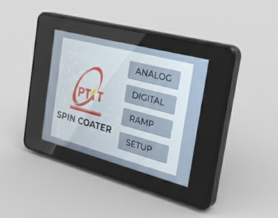
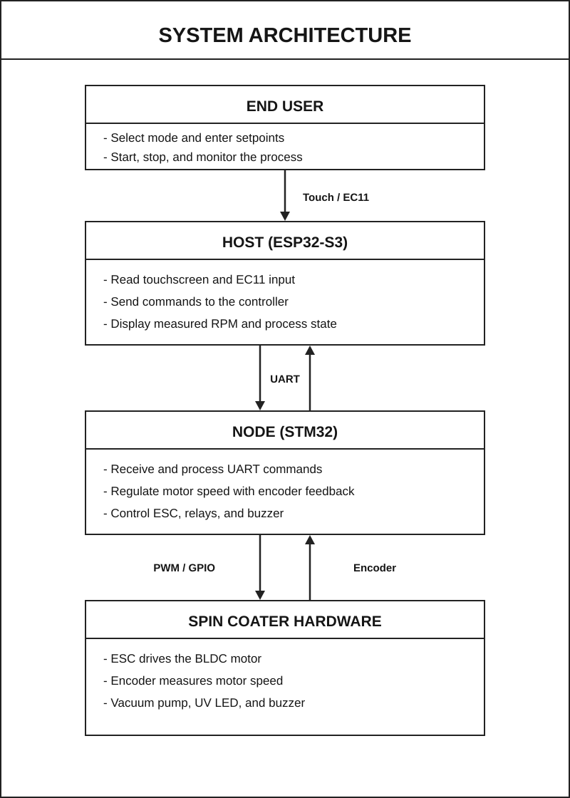
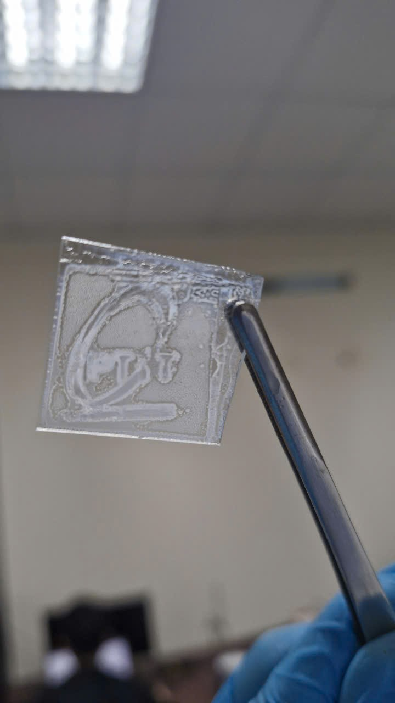
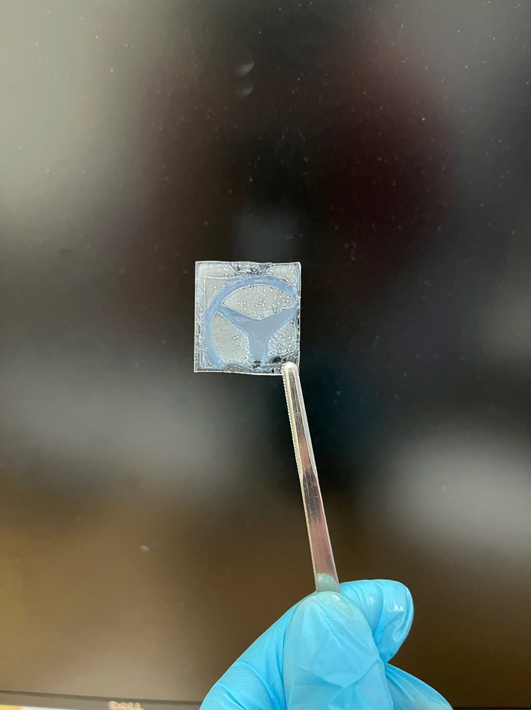
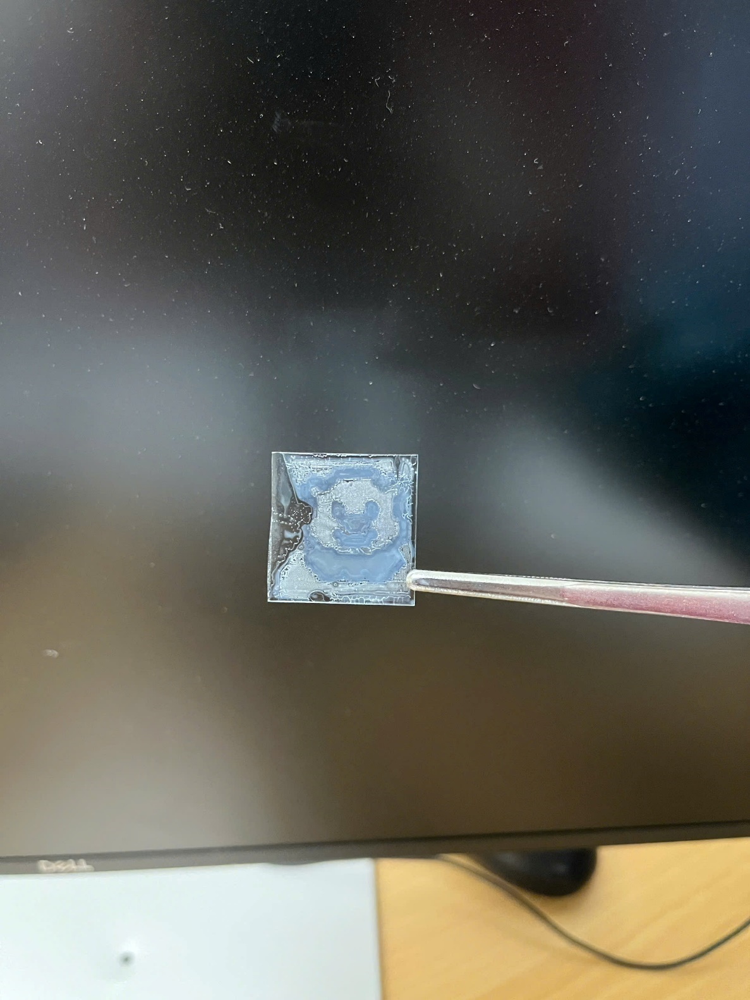
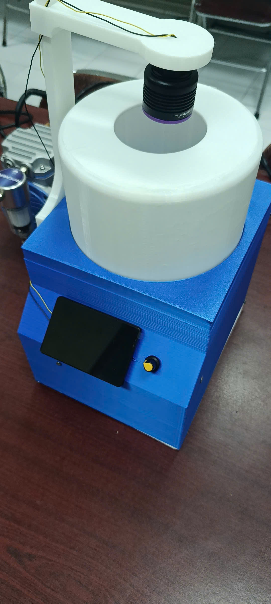

# Máy Spin Coater

[English](README.md) | **Tiếng Việt**

Máy quay phủ màng mỏng (spin coater) dùng hai vi điều khiển: **STM32F103** đảm nhận
điều khiển động cơ vòng kín theo thời gian thực, còn **ESP32-S3** với màn hình cảm ứng
LVGL đóng vai trò giao diện người dùng. Hai board trao đổi với nhau qua giao thức UART
có đóng khung (framed).

**Tác giả:** Bùi Văn Hải

---

## 1. Tổng quan

<p align="center">
  
</p>

Máy spin coater tạo lớp màng mỏng đồng đều trên đế (substrate) bằng cách nhỏ dung dịch
lên mâm quay; độ dày màng phụ thuộc vào tốc độ và thời gian quay. Dự án này hiện thực toàn
bộ hệ thống điều khiển cho một chiếc máy như vậy.

Thiết kế chia trách nhiệm cho hai vi điều khiển:

- **STM32F103C8 (Bộ điều khiển / "Slave")** — chạy vòng điều khiển thời gian thực: đọc tốc
  độ động cơ từ encoder quadrature, dẫn động động cơ không chổi than qua ESC, và ổn định
  RPM bằng bộ điều khiển PID kèm bộ tạo profile ramp tuyến tính. Ngoài ra còn đóng/ngắt
  relay bơm chân không, đèn UV LED và điều khiển còi báo.
- **ESP32-S3 (HMI / "Master")** — điều khiển màn hình cảm ứng 320×480 thông qua LVGL (giao
  diện tạo bằng SquareLine) và một encoder xoay EC11. Cho phép người vận hành chọn chế độ,
  nhập giá trị đặt (setpoint), bắt đầu/dừng quá trình và theo dõi RPM đo được theo thời
  gian thực.

Người vận hành đặt giá trị mục tiêu trên ESP32; ESP32 gửi lệnh xuống STM32; STM32 chạy động
cơ và gửi ngược RPM đo được về với tần suất 20 Hz để hiển thị trực tiếp.

Hệ thống hỗ trợ ba chế độ vận hành:

| Chế độ | Mô tả |
| --- | --- |
| **Analog** | Quay ở một mức RPM mục tiêu đặt bằng encoder xoay. |
| **Digital** | Quay ở một mức RPM mục tiêu nhập bằng số trên màn hình cảm ứng. |
| **Ramp** | Công thức nhiều giai đoạn: ramp lên `min_rpm`, giữ trong `time_min`, ramp lên `max_rpm`, giữ trong `time_max`, rồi ramp xuống và kết thúc. |

---

## 2. Phần cứng

| Thành phần | Chi tiết |
| --- | --- |
| MCU điều khiển | STM32F103C8 ("Blue Pill"), 72 MHz, thư viện SPL |
| MCU giao diện | ESP32-S3 (N16R8V, 16 MB flash / 8 MB PSRAM) |
| Màn hình | IPS 320×480, IC cảm ứng điện dung AXS15231B |
| Động cơ | Động cơ BLDC dẫn động qua ESC (PWM kiểu servo 50 Hz) |
| Cảm biến tốc độ | Encoder quadrature, 16 vạch × 4 (quadrature) = 64 CPR |
| Ngõ vào xoay | Encoder xoay EC11 (nhập setpoint trên ESP32) |
| Cơ cấu chấp hành | Bơm chân không + đèn UV LED, mỗi cái một kênh relay |
| Phản hồi | Còi piezo báo trạng thái/xác nhận |

### Sơ đồ chân STM32F103

| Chức năng | Chân | Ngoại vi |
| --- | --- | --- |
| PWM ESC | PA8 | TIM1_CH1 (ngõ ra PWM) |
| Encoder A / B | PA1 / PA0 | TIM2 (giao tiếp encoder, x4) |
| Còi báo | PA7 | GPIO |
| Relay 1 — UV LED | PB0 | GPIO |
| Relay 2 — Bơm chân không | PB1 | GPIO |
| UART1 | — | Debug / log @ 115200 |
| UART2 | — | Kết nối với ESP32 @ 115200 |

### Định thời PWM cho ESC

TIM1 được cấu hình tick 1 MHz (`Prescaler = 24-1` từ 24 MHz) với chu kỳ 60000 tick
(20 ms → khung servo 50 Hz). Duty được biểu diễn theo số tick timer:

- `ESC_MIN_PWM = 4500` (~1.5 ms, nghỉ / đã arm)
- `ESC_MAX_PWM = 6000` (~2.0 ms, tốc độ tối đa)

---

## 3. Kiến trúc phần mềm



### Phía STM32 (`stm32f103c8/`)

Chạy super-loop bare-metal trên thư viện SPL. `main.c` gọi `app_setup()` một lần, sau đó
lặp `app_loop()` mãi mãi. Cấu trúc phân lớp:

- **`drivers/`** — lớp bọc ngoại vi cấp thấp: `uart` (RX ring buffer theo ngắt, API dạng
  driver-object cho UART1/2/3) và `delay` (bộ đếm tick SysTick, `get_tick()`).
- **`components/`** — driver thiết bị: `esc_driver` (PWM + chuyển đổi RPM↔duty),
  `encoder` (quadrature TIM2, đo RPM), `io_driver` (relay + máy trạng thái còi không chặn).
- **`control_algorithms/`** — `pid` (PID kèm bias feed-forward và chống bão hoà tích phân)
  và `kalmanfilter` (sẵn sàng để lọc tín hiệu tốc độ).
- **`modes/`** — `coater` (setpoint PID + bộ tạo profile ramp) và `mode` (logic từng chế
  độ và máy trạng thái Ramp).
- **`protocol_uart/`** — `message` (dựng/giải khung + CRC), `convert` (union byte↔số),
  `protocol_uart` (điều phối lệnh + gửi telemetry).

### Phía ESP32 (`esp32_s3_hmi/`)

Dùng framework Arduino qua PlatformIO. `main.cpp` khởi tạo LVGL và giao diện, rồi trong
`loop()` bơm LVGL và, tuỳ theo chế độ/trạng thái đang hoạt động, đọc các khung đến và cập
nhật widget hiển thị RPM đo được.

- **`lib/lib_screen/`** — giao diện xuất từ SquareLine Studio (`ui.c`, screens, fonts,
  images).
- **`src/lvgl/`** — lớp kết nối LVGL: khởi tạo màn hình, driver cảm ứng `AXS15231B`, cấu
  hình chân/màn hình.
- **`src/`** — logic ứng dụng: `app_control` (máy trạng thái chế độ), `ec11` (ngõ vào
  xoay), `frame_io` + `msg` + `convert` (giao thức, đối xứng với phía STM32), và các bộ
  điều khiển từng màn hình (`screen_analog`, `screen_digital`, `screen_ramp`).

---

## 4. Tính năng

- Ba chế độ quay: **Analog**, **Digital**, và công thức **Ramp** nhiều giai đoạn.
- Điều khiển RPM vòng kín bằng PID + tạo profile ramp tuyến tính để tăng/giảm tốc mượt.
- Mô hình feed-forward logistic (phi tuyến) RPM↔duty để PID chỉ cần tinh chỉnh phần dư.
- Truyền telemetry RPM đo được về HMI với tần suất ~20 Hz (mỗi 50 ms).
- Chuyển chế độ an toàn: khi đang quay mà đổi chế độ thì ramp động cơ xuống trước.
- Ramp-down thân thiện khẩn cấp, có thể ngắt ngang một quá trình ramp-up đang chạy.
- Điều khiển relay bơm chân không và đèn UV LED từ màn hình cảm ứng.
- Máy trạng thái còi không chặn báo trạng thái (sẵn sàng, đổi chế độ, start/stop, kết thúc
  ramp).
- Đóng khung UART chắc chắn với kiểm tra CRC-16 (Modbus) và phục hồi khi tràn buffer.
- Giao diện HMI màn hình cảm ứng + encoder xoay dựng bằng LVGL 9.

---

## 5. Thuật toán điều khiển

### Đo tốc độ

Encoder chạy ở chế độ quadrature x4 với TIM2 (64 xung/vòng). `encoder_get_pulse_count()`
lấy mẫu bộ đếm trong một cửa sổ thời gian (mặc định 50 ms), xử lý tràn số bộ đếm 16-bit
bằng phép trừ có dấu, loại bỏ các cửa sổ quá ngắn (<80% thời gian yêu cầu), và hiệu chỉnh
số xung về đúng cửa sổ danh định. `encoder_get_rpm()` chuyển đổi:

```
rpm = (số xung / CPR) * (60000 / sample_time_ms)
```

### Feed-forward: mô hình logistic RPM ↔ duty

Đáp ứng của động cơ + ESC là phi tuyến, nên thay vì ánh xạ tuyến tính, driver dùng một
đường cong logistic khớp với đặc tuyến đo được:

```
rpm  = L / (1 + exp(-K * (duty - D0)))          // esc_duty_to_rpm_logistic
duty = D0 - ln(L/rpm - 1) / K                    // esc_rpm_to_duty_logistic
```

với `L = 5777`, `K = 0.00945`, `D0 = 4757`. Công thức này cho ước lượng vòng hở `baseDuty`
tốt cho mọi RPM mục tiêu; PID sau đó chỉ cần chỉnh phần sai số còn lại.

### Bộ điều khiển PID

`pid_update()` tính lượng hiệu chỉnh cộng thêm vào bias feed-forward:

```
output = ubias(baseDuty) + (P + I + D)
```

- **P** = `kp · error`, với `error = setpoint − đo_được`.
- **I** = tích luỹ `ki · error · dt`, có chống bão hoà: phần tích phân được tính ngược
  (back-calculation) sao cho tổng lượng hiệu chỉnh không vượt `max_output`.
- **D** = đạo hàm trên biến đo (`−kd · Δđo_được / dt`) để tránh "derivative kick", với `dt`
  giới hạn ≤10 ms nhằm loại bỏ gai nhiễu.
- Có thể bật deadband để bỏ qua P/I trong một dải sai số nhỏ.

Bộ thông số mặc định (`main.c`): `kp = 0.1`, `ki = 1.0`, `kd = 0.0`, `max_output = 1500`.

Khi setpoint về ~0, động cơ được đưa về trạng thái nghỉ và tích phân/đạo hàm PID được reset
để tránh bão hoà tích phân.

### Tạo profile ramp

Việc thay đổi tốc độ không bao giờ là lệnh nhảy bậc (step) đưa thẳng vào PID.
`coater_ramp_up()` / `coater_ramp_down()` tạo một **profile setpoint tuyến tính** từ RPM
hiện tại đến mục tiêu qua một số `steps` trong `ramp_time_ms`, tiến từng bước một trong
`coater_update_ramp_profile()`. PID bám theo setpoint đang di chuyển này, nhờ đó gia tốc
mượt và có giới hạn. Ramp-down được phép chen ngang một ramp-up đang chạy để dừng an toàn.

### Máy trạng thái chế độ Ramp (`mode_ramp_update`)

```
RAMP_IDLE
  └─(start)→ RAMP_TO_MIN ──(đạt tới)──▶ RAMP_HOLD_MIN ──(time_min)──▶
             RAMP_TO_MAX ──(đạt tới)──▶ RAMP_HOLD_MAX ──(time_max)──▶
             RAMP_FINISH ──(đã dừng)──▶ (gửi RAMP_FINISH) → RAMP_IDLE

  (stop) ──▶ RAMP_STOP ──(đã dừng)──▶ RAMP_IDLE   // ramp xuống, không gửi FINISH
```

Chế độ Analog/Digital dùng lại chính các hàm nền tảng này: với một mục tiêu mới, chúng ramp
lên hoặc xuống tuỳ dấu của sai số (kèm deadzone 15 RPM). Setpoint RPM được kẹp trong khoảng
`[0, 6000]`.

---

## 6. Giao thức UART

Cả hai board trao đổi các khung có bố cục cố định, little-endian, qua UART ở tốc độ
**115200 8-N-1**.

### Định dạng khung

```
┌─────────────┬───────────┬─────────┬───────────────┬──────────────┐
│ Start (2 B) │ Type (1)  │ Len (1) │ Data (0..12 B)│  CRC-16 (2 B) │
│   0xAA55    │  0xNN     │  = N    │  dữ liệu      │  Modbus, LE   │
└─────────────┴───────────┴─────────┴───────────────┴──────────────┘
```

- **Start** — dấu nhận diện `0xAA55` (trên đường truyền là little-endian: `0x55 0xAA`).
- **Type** — loại thông điệp (xem các bảng bên dưới).
- **Len** — độ dài phần data theo byte (0–12).
- **Data** — dữ liệu; số nhiều byte theo little-endian (`uint16` cho RPM/thời gian,
  `float` cho RPM).
- **CRC-16** — CRC Modbus (đa thức `0xA001`, khởi tạo `0xFFFF`) tính trên `Start..Data`.

Bộ nhận phía STM32 (`uart_parser_from_esp`) tái đồng bộ theo dấu Start, kiểm tra độ dài,
kiểm CRC, và phục hồi khi tràn bằng cách reset buffer. Mỗi lượt vòng lặp chỉ xử lý tối đa
3 khung để không làm nghẽn vòng điều khiển.

### Master → Slave (ESP32 → STM32)

| Type | Giá trị | Dữ liệu | Ý nghĩa |
| --- | --- | --- | --- |
| `SET_ANALOG` | `0x10` | — | Vào chế độ Analog |
| `SET_DIGITAL` | `0x11` | — | Vào chế độ Digital |
| `SET_RAMP` | `0x12` | — | Vào chế độ Ramp |
| `RELAY_VACUUM_ON` | `0x13` | — | Bật bơm chân không |
| `RELAY_VACUUM_OFF` | `0x14` | — | Tắt bơm chân không |
| `RELAY_UV_LED_ON` | `0x15` | — | Bật đèn UV LED |
| `RELAY_UV_LED_OFF` | `0x16` | — | Tắt đèn UV LED |
| `ANALOG_START` | `0x20` | `u16 rpm` | Chạy Analog ở mức RPM |
| `ANALOG_STOP` | `0x21` | — | Dừng Analog |
| `DIGITAL_START` | `0x40` | `u16 rpm` | Chạy Digital ở mức RPM |
| `DIGITAL_STOP` | `0x41` | — | Dừng Digital |
| `RAMP_START` | `0x60` | `u16 min_rpm, u16 t_min(s), u16 max_rpm, u16 t_max(s)` | Chạy công thức Ramp |
| `RAMP_STOP` | `0x61` | — | Dừng Ramp |

> Lưu ý: trong `RAMP_START`, hai trường thời gian được gửi theo **giây** và được đổi sang
> mili-giây ở phía STM32.

### Slave → Master (STM32 → ESP32)

| Type | Giá trị | Dữ liệu | Ý nghĩa |
| --- | --- | --- | --- |
| `ANALOG_MRPM_UPDATE` | `0x31` | `float rpm` | RPM đo được (Analog) |
| `DIGITAL_MRPM_UPDATE` | `0x51` | `float rpm` | RPM đo được (Digital) |
| `RAMP_MRPM_UPDATE` | `0x71` | `float rpm` | RPM đo được (Ramp) |
| `RAMP_FINISH` | `0x72` | 1 B | Đã hoàn thành công thức Ramp |

Telemetry (`MRPM_UPDATE`) được gửi mỗi 50 ms trong khi một chế độ đang chạy.

---

## 7. Cấu trúc thư mục

```
spin_coater/
├── stm32f103c8/                 # Firmware điều khiển thời gian thực (Keil MDK-ARM, SPL)
│   ├── core/                       # main.c/.h — app_setup() + app_loop()
│   ├── drivers/                    # uart, delay (SysTick)
│   ├── components/                 # esc_driver, encoder, io_driver (relay/còi)
│   ├── control_algorithms/         # pid, kalmanfilter
│   ├── modes/                      # coater (PID+ramp), mode (logic chế độ + FSM ramp)
│   ├── protocol_uart/              # message (đóng khung/CRC), convert, protocol_uart
│   ├── board_config/Inc/           # pinmap.h
│   └── MDK-ARM/                    # Project Keil (spin_coating.uvprojx), RTE, SPL
│
└── esp32_s3_hmi/                    # Firmware giao diện HMI (PlatformIO / Arduino)
    ├── platformio.ini              # env: esp32-s3-n16r8v, LVGL 9.3, GFX, ESP32Encoder
    ├── include/                    # app_control, frame_io, msg, convert, ec11, screen_*
    ├── src/
    │   ├── main.cpp                # setup()/loop(), telemetry → giao diện
    │   ├── app_control.cpp         # máy trạng thái chế độ
    │   ├── ec11.cpp                # ngõ vào encoder xoay
    │   ├── frame_io/msg/convert    # giao thức (đối xứng với STM32)
    │   ├── screen_*.cpp            # bộ điều khiển từng màn hình
    │   └── lvgl/                    # khởi tạo LVGL + driver cảm ứng AXS15231B + cấu hình
    └── lib/lib_screen/            # Giao diện xuất từ SquareLine (ui.c, screens, fonts, images)
```

---

## 8. Biên dịch & Nạp

### STM32 (Keil MDK-ARM)

1. Mở `stm32f103c8/MDK-ARM/spin_coating.uvprojx` trong Keil µVision (MDK-ARM).
2. Thiết bị đích: **STM32F103C8**. Project dùng thư viện Standard Peripheral Library (SPL);
   các phụ thuộc được quản lý qua thư mục RTE.
3. Build (F7) và nạp qua ST-Link (Load / F8).

### ESP32-S3 (PlatformIO)

```bash
cd esp32_s3_hmi

# Biên dịch
pio run

# Biên dịch, nạp và mở serial monitor
pio run -t upload -t monitor
```

Môi trường và phụ thuộc được khai báo trong `platformio.ini`:

- Board: `esp32-s3-n16r8v`, framework: `arduino`, tốc độ monitor: `115200`
- Thư viện: `lvgl@^9.3.0`, `GFX Library for Arduino@1.5.0`, `ESP32Encoder@^0.11.8`

### Đấu dây kết nối

Nối chéo UART của ESP32 với **UART2** của STM32 (TX↔RX, RX↔TX) và nối chung GND. Cả hai
chạy 115200 8-N-1. **UART1** của STM32 để dành cho việc debug/log.

---

## 9. Minh hoạ

Một lần chạy Ramp điển hình:

1. Trên HMI, chọn chế độ **Ramp** → ESP32 gửi `SET_RAMP` (`0x12`); STM32 kêu bíp.
2. Nhập `min_rpm`, `time_min`, `max_rpm`, `time_max` rồi nhấn start → ESP32 gửi
   `RAMP_START` (`0x60`) kèm dữ liệu 8 byte.
3. STM32 ramp lên `min_rpm`, giữ, ramp lên `max_rpm`, giữ, rồi ramp xuống, đồng thời gửi
   `RAMP_MRPM_UPDATE` (`0x71`) mỗi 50 ms để màn hình hiển thị RPM trực tiếp.
4. Khi hoàn thành, STM32 gửi `RAMP_FINISH` (`0x72`) và kêu bíp hai lần.

Chế độ Analog/Digital đơn giản hơn: chọn mục tiêu (encoder xoay hoặc nhập số), start, và
theo dõi RPM đo được hội tụ về setpoint.

### Kết quả — màng mỏng quay phủ bằng máy

Màng mỏng tạo hình trên đế thủy tinh, quay phủ bằng chính chiếc máy này:

|  |  |  |
| :---: | :---: | :---: |
| **Logo PTIT** — logo trường | **Logo Mercedes** | **Logo con gấu** |

### Video

[](https://github.com/Rephania/spin-coater-/releases/download/v1.0.0/demo_spin_coater.mp4)

▶️ Bấm vào ảnh trên để xem video demo đầy đủ (lưu ở trang
[Releases](https://github.com/Rephania/spin-coater-/releases/tag/v1.0.0)).

<!--
  Muốn video PHÁT NGAY trong README thay vì link tải: kéo–thả file .mp4 vào ô comment/issue
  bất kỳ trên GitHub, copy link https://github.com/user-attachments/assets/... nó sinh ra,
  rồi dán vào đây trên một dòng riêng.
-->


---

## 10. Bài học rút ra

- **Feed-forward tốt hơn là ép PID.** Khớp một đường cong logistic RPM↔duty rồi để PID chỉ
  chỉnh phần dư giúp việc tinh chỉnh dễ hơn nhiều và đáp ứng tốt hơn so với ánh xạ tuyến
  tính kèm khâu tích phân nặng.
- **Đừng bao giờ nhảy bậc setpoint.** Cấp cho PID một setpoint được ramp tuyến tính thay vì
  nhảy thẳng đến mục tiêu giúp loại bỏ vọt lố và ứng suất cơ khí khi khởi động/dừng.
- **Chống bão hoà tích phân rất quan trọng.** Tính ngược tích phân theo `max_output` (và
  reset khi RPM về ~0) tránh được độ trễ hồi phục dài đặc trưng khi khâu tích phân bị bão
  hoà.
- **Đóng khung chắc chắn rất đáng công.** Dấu Start + độ dài + CRC-16, cộng với reset khi
  tràn buffer và giới hạn số khung mỗi vòng, giữ liên kết UART ổn định mà không bao giờ làm
  nghẽn vòng điều khiển.
- **Chia tách trách nhiệm giữa các MCU.** Giữ phần điều khiển thời gian thực cứng trên STM32
  và phần giao diện nặng đồ hoạ trên ESP32-S3 giúp mỗi bên luôn phản hồi nhanh.
- **Không chặn ở mọi nơi.** Máy trạng thái còi và lập lịch theo tick (`get_tick()`) giữ cho
  super-loop không dính các lệnh `delay()` gây treo điều khiển.

---

## Giấy phép

Phát hành theo [Giấy phép MIT](LICENSE) © 2026 Bùi Văn Hải.
